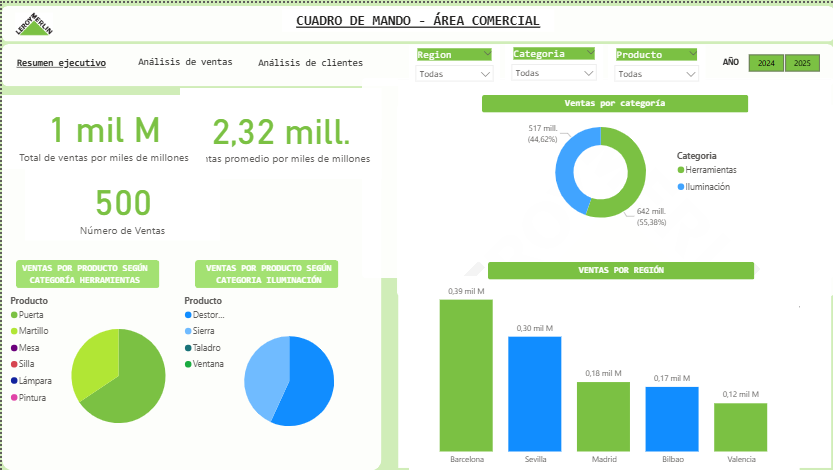
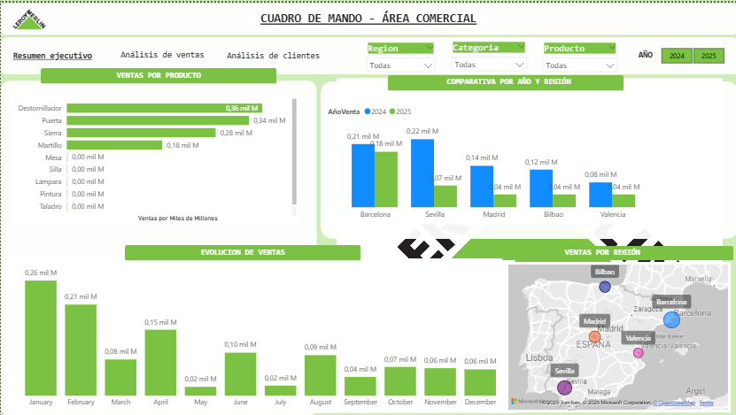
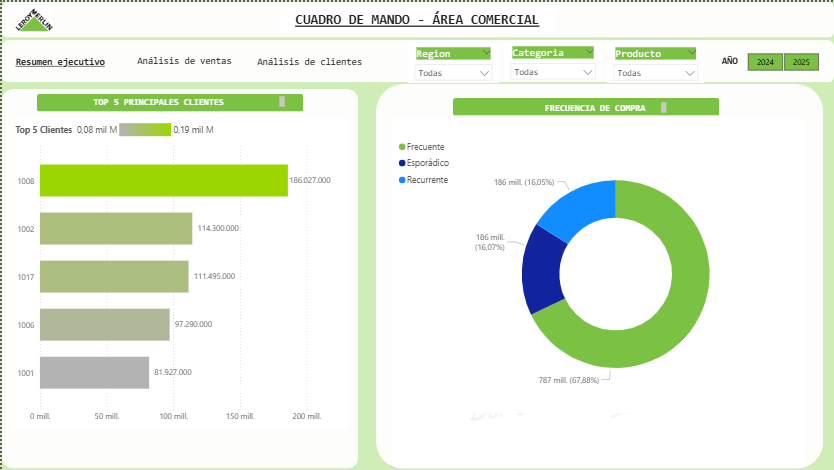

# analisis-ventas-sql-dashboard
Análisis comercial con visualizaciones y consultas SQL. Incluye dashboard interactivo y métricas clave para la toma de decisiones.
#  Cuadro de Mando – Leroy Merlin

Este proyecto presenta un dashboard interactivo desarrollado en **Power BI**, acompañado de un análisis exploratorio con **consultas SQL**, enfocado en el desempeño comercial de una tienda simulada de Leroy Merlin. Fue creado con fines demostrativos para evidenciar habilidades en visualización de datos, análisis de ventas y manejo de herramientas de inteligencia de negocios.

---

## 🏆 Objetivo del proyecto

- Evaluar el rendimiento comercial por región, categoría y producto.
- Identificar los productos más vendidos y las regiones con mayor volumen de ventas.
- Analizar la evolución mensual y anual de las ventas.
- Estimar el ticket promedio por comprador.
- Crear una herramienta visual para la toma de decisiones estratégicas.

---

## 🔨 Herramientas utilizadas

- **Power BI** para la visualización interactiva.
- **MySQL** para la extracción y el análisis de datos.
- **Excel** como intermediario para la limpieza y carga de datos.

---

## 📠 Archivos incluidos

- `CM Leroy Merlin.pbix`: archivo del dashboard en Power BI.
- `analisis_leroy.sql`: script SQL con las consultas utilizadas.

---

## 💻 Consultas SQL

Las consultas SQL utilizadas permitieron responder preguntas clave como:

- ¿Cuál es la categoría más vendida?
- ¿Cuáles son las regiones con mayor volumen de ventas?
- ¿Qué producto lidera en ventas por región?
- ¿Cuál es el ticket promedio por cliente?

Puedes ver el script completo aquí  [`analisis_leroy.sql`](./analisis_leroy.sql)

## 🎨 Vista del dashboard (Power BI)

| Resumen Ejecutivo | Análisis de Ventas | Análisis de Clientes |
|-------------------|--------------------|-----------------------|
|  |  |  |

## 📗 Principales hallazgos

- La categoría **Herramientas** fue la más vendida.
- **Barcelona** lideró en ventas, seguida por Sevilla y Madrid.
- El **destornillador** fue el producto más vendido.
- La mayoría de los clientes fueron **frecuentes**.
- El mes con mayor facturación fue **enero**.
- El ticket promedio más alto por cliente superó los **2.3 millones** (simulados).
